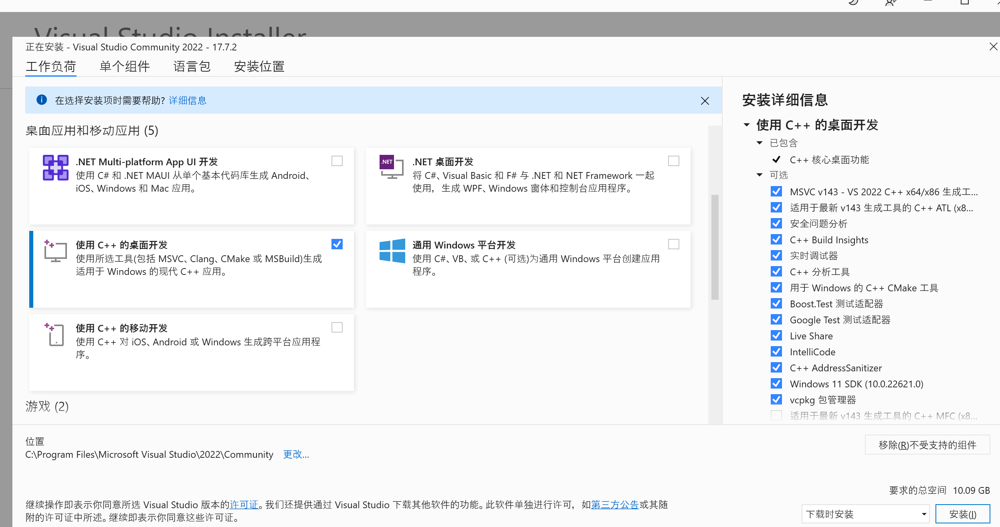
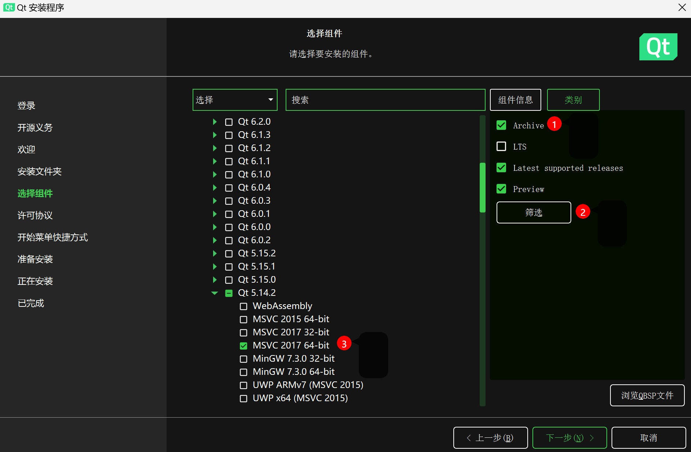
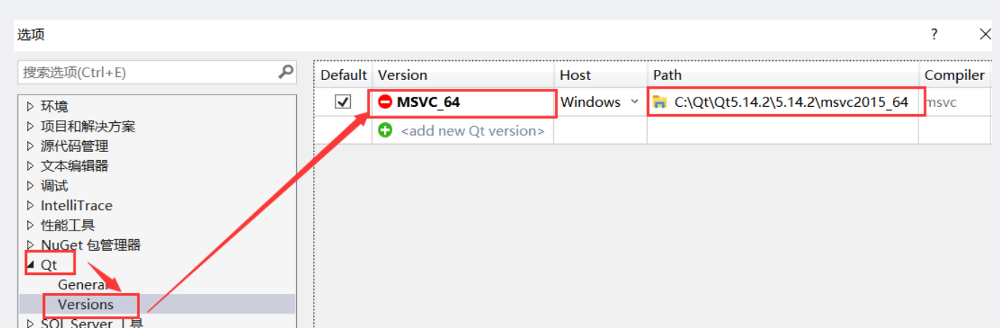

# `chatroom`项目

## 项目简介

一个可以创建一对一私密聊天或者邀请多个人实时聊天的Windows应用

## 目录结构说明 

- documents -- 项目开发相关文档（如：项目需求文档、设计文档等等）  
- projects  -- 项目源码（比如：前端项目、后端项目等等）

## 软件架构

### 后端技术

|技术|说明|版本|备注|
|--|--|--|--|
|boost.asio|通信|||
|epoll/select|IO多路复用|||
|MySQL C API|操作数据库|||

### 前端技术

|技术|说明|版本|备注|
|--|--|--|--|
|QT|图形界面展示|5.14.2|https://www.qt.io/|

## 环境搭建

### 开发工具

|工具|说明|版本|备注|
|--|--|--|--|
|VS 2022|开发IDE||https://visualstudio.microsoft.com/|
|Navicat|数据库连接工具||http://www.formysql.com/xiazai.html|

### 开发环境

|工具|版本|备注|
|--|--|--|
|Linux||服务器运行环境|
|Windows||客户端运行环境|
|MySQL||https://www.mysql.com/cn/|

### 安装教程
#### 前端：
- 安装vs2022, 选如图所示组件：


- 下载qt在线安装版, 选如图所示组件：


- 打开vs下载qt插件


- 将qt连接到vs


- 在windows环境下双击frontend/ChatRoom.sln


#### 后端:
- 这里以ubuntu22.04举例
运行以下代码
```bash
sudo apt update
sudo apt install git g++ cmake libmysqlcppconn-dev
git https://github.com/AnceYin/chatroom.git
cd chatroom/backend/
mkdir build
cd build
cmake ..
make
./ChatRoom/ChatRoom
```

## 开发进度

暂无
